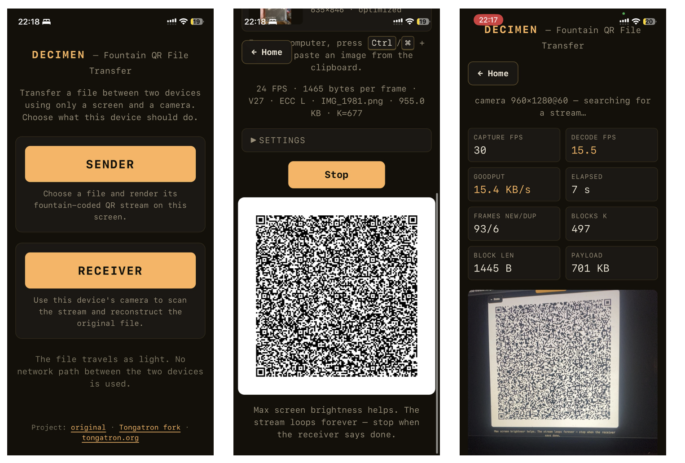
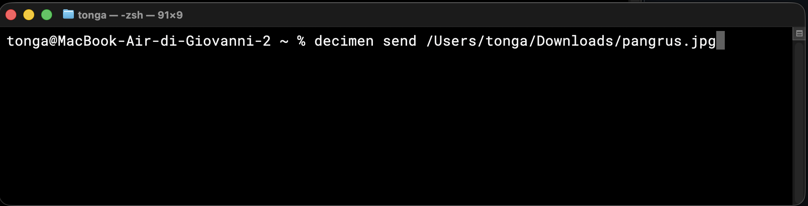
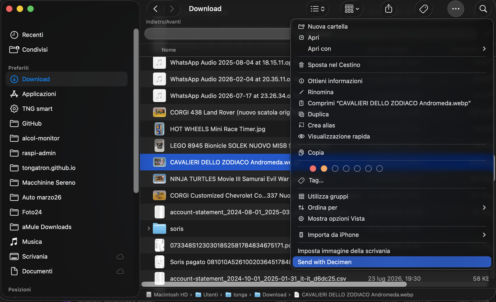

# Decimen Optical Transfer

Transfer files directly from one device's screen to another device's camera
with an animated, fountain-coded QR stream. The transfer needs no network path
between the devices, account, pairing, native app, or intermediary server: the
payload travels as light.

[](https://github.com/tongatron/decimen-optical-transfer/actions/workflows/ci.yml)
[](https://optical-transfer.tongatron.org/)
[](LICENSE)
[](https://nodejs.org/)

**[Open the live app](https://optical-transfer.tongatron.org/)** ·
**[Leggi in italiano](README.it.md)**

> **Status:** maintained prototype. The web app is usable today; the current
> payload limit is 2 MB and the macOS package is unsigned and not notarized.

> This repository is a maintained fork of
> [bashalarmistalt/decimen-optical-transfer](https://github.com/bashalarmistalt/decimen-optical-transfer).
> It preserves the original MIT license and credits.

<p align="center">
  
</p>

## Contents

- [Highlights](#highlights)
- [Changes from the original project](#changes-from-the-original-project)
- [Use the hosted app](#use-the-hosted-app)
- [Install as a PWA](#install-as-a-pwa)
- [Download the macOS installer](#download-the-macos-installer)
- [Local development and self-hosting](#local-development-and-self-hosting)
  - [Requirements](#requirements)
  - [Development server](#development-server)
  - [Production build](#production-build)
- [CLI and desktop file-manager integrations](#cli-and-desktop-file-manager-integrations)
  - [Install the CLI](#install-the-cli)
  - [Choose the Receiver host](#choose-the-receiver-host)
  - [CLI options](#cli-options)
  - [macOS Finder](#install-the-finder-action-on-macos)
  - [Windows File Explorer](#install-the-file-explorer-action-on-windows)
  - [Linux file managers](#install-the-file-manager-actions-on-linux)
- [How it works](#how-it-works)
- [Tuning](#tuning)
- [Privacy and limitations](#privacy-and-limitations)
- [Development scripts and diagnostics](#development-scripts-and-diagnostics)
- [Tests](#tests)
- [Acknowledgements](#acknowledgements)
- [License](#license)

## At a glance

| | Details |
|---|---|
| **Transport** | Animated QR codes from a screen to a camera |
| **Recovery** | LT fountain coding tolerates loss, duplicates, reordering, and late starts |
| **Privacy** | File bytes stay on the sender and receiver; no relay is required |
| **Web app** | PWA with Send/Receive routes and offline app shell |
| **CLI** | `decimen send` with macOS Finder, Windows Explorer, and Linux file-manager integrations |
| **Limit** | 2 MB per file |

## Highlights

- Transfers any file up to 2 MB while preserving its name and media type.
- Optimizes JPEG, PNG, and WebP images larger than 1 MB in the browser.
- Accepts files from the system picker or screenshots pasted from the clipboard.
- Optionally sends files from the CLI through a local, browser-rendered QR stream.
- Uses fountain coding, so missed or out-of-order frames do not require a restart.
- Verifies the reconstructed payload before offering it for download.
- Works on Safari/iOS through `zxing-wasm`; it does not depend on
  `BarcodeDetector`.
- Installs as a PWA with an offline app shell and Send/Receive shortcuts.
- Keeps file contents on the two devices. The web server only delivers the app.

## Changes from the original project

The upstream proof of concept sends a bundled sample image. This fork adds:

- arbitrary file selection, metadata preservation, and a 2 MB payload limit;
- automatic browser-side optimization for large supported images;
- clipboard image and screenshot pasting on the sender;
- explicit sender start/pause controls and automatic restart after setting
  changes;
- a dedicated home screen, persistent navigation, responsive styling, and
  clearer transfer status;
- an installable PWA, generated service worker, offline app shell, icons, and
  update-safe cache handling;
- optional, environment-configured Umami analytics that never receives file
  contents;
- production-ready static hosting support.

For the exact code-level delta, compare this repository with
[`upstream/main`](https://github.com/bashalarmistalt/decimen-optical-transfer/compare/main...tongatron:main).

## Use the hosted app

1. Open [optical-transfer.tongatron.org](https://optical-transfer.tongatron.org/)
   on both devices.
2. Choose **Sender** on the device displaying the QR stream (a laptop or tablet
   works best).
3. Select a file, or paste an image with <kbd>Ctrl</kbd>/<kbd>⌘</kbd> +
   <kbd>V</kbd>, then choose **Start transmission**.
4. Choose **Receiver** on the camera device, allow camera access, and point it
   at the animated QR code.
5. When verification completes, download the reconstructed file. On compatible
   mobile browsers, use the native share sheet and choose **Save to Files** to
   preserve the transferred bytes exactly.

For best throughput, maximize the QR code, increase the sender's screen
brightness, and keep the receiving device steady.

### Quick start from the CLI

The CLI is optional. After installing Node.js 18+ and the project dependencies:

```bash
npm install
npm run build:cli
npm link
decimen send ./document.pdf
```

The command opens a local sender page. Use Decimen's **Receiver** on the second
device and point its camera at the animated QR stream. The file is served only
from `127.0.0.1`; it is not uploaded to the configured Receiver app host.

## Install as a PWA

- **Android and desktop Chromium:** open the hosted site and choose the browser's
  **Install app** action.
- **iPhone and iPad:** open the site in Safari, choose **Share**, then
  **Add to Home Screen**.
- **Any supported browser:** installation is optional; the web app works
  directly from its URL.

The installed PWA still needs camera permission on the receiving device.

## Download the macOS installer

The latest macOS package includes the Decimen CLI, the web app build, and the
Finder action **Send with Decimen**:

**[Download Decimen 0.2.0 for macOS](https://github.com/tongatron/decimen-optical-transfer/releases/download/v0.2.0/Decimen-0.2.0.dmg)**

Open the DMG, double-click **Install Decimen.app**, and follow the macOS
prompts. After installation, select a file in Finder and choose **Send with
Decimen** from the action menu. Node.js 18 or newer is required on the Mac;
the package is currently unsigned and not notarized.

## Local development and self-hosting

### Requirements

- Node.js 18 or newer (a current LTS release is recommended)
- npm
- two devices on the same local network for a realistic screen-to-camera test

### Development server

```bash
git clone https://github.com/tongatron/decimen-optical-transfer.git
cd decimen-optical-transfer
npm install
npm run dev
```

Then:

1. On the sending device, open `https://localhost:5173/send/`.
2. On the receiving device, open the `Network` URL printed by Vite, ending in
   `/receive/`.
3. Accept the self-signed certificate warning once on each device.
4. Allow camera access on the receiver and start a transfer.

HTTPS is required because browsers expose `getUserMedia()` only in secure
contexts (except on `localhost`). The development server uses a self-signed
certificate through `@vitejs/plugin-basic-ssl`, so a first-visit warning is
expected.

### Production build

```bash
npm run build
npm run preview
```

The deployable static site is generated in `dist/`. Host that directory at the
root of an HTTPS origin. A reusable Nginx example is available at
[`deploy/nginx-optical-transfer.conf`](deploy/nginx-optical-transfer.conf).

## CLI and desktop file-manager integrations

The hosted web app and PWA do not require the CLI. This optional integration is
for users who want to start a transfer from a terminal or directly from the file
manager on macOS, Windows, or Linux. It accepts a file path, opens a local
browser page containing the animated QR stream, and uses the same file envelope,
fountain encoder, and frame protocol as the web sender.

### Install the CLI

Install the project dependencies and link the `decimen` executable once:

```bash
npm install
npm run build:cli
npm link
```

The command then works from any directory:

```bash
decimen send ./document.pdf
decimen send /absolute/path/to/document.pdf
```

<p align="center">
  
</p>

Check the installation or list the available options with:

```bash
decimen --version
decimen --help
```

### Choose the Receiver host

Run the guided setup after installing the CLI:

```bash
decimen setup
```

The setup offers three choices:

1. the recommended public Receiver at
   `https://optical-transfer.tongatron.org/`;
2. a custom private or public HTTPS deployment;
3. local/self-hosted build and deployment instructions.

The public host is the default even if setup has not been run. For unattended
installations, use one of these commands:

```bash
decimen setup --public
decimen setup --host https://decimen.example/
decimen setup --self-hosted
```

Inspect or change the selection later with:

```bash
decimen config show
decimen config host https://decimen.example/
decimen config use-public
```

Custom hosts must use HTTPS; plain HTTP is accepted only for `localhost`. The
choice is stored in the user's configuration directory. It identifies the app
to open on the receiving device and is shown by `decimen send`; file contents
are still served only from `127.0.0.1` and transferred through the animated QR
stream. Setup may offer to open the GitHub project page, but leaving a star is
always optional and is never checked.

During development, `npm run send -- ./document.pdf` remains available as an
equivalent repository-local command. Run
`npm unlink -g decimen-optical-transfer` to remove the globally linked command.

The command binds a temporary HTTP server to `127.0.0.1`, prints its URL, and
opens it in the default browser. The server is reachable only from the sending
computer; the file is not uploaded anywhere.

To receive the file:

1. Keep the CLI process and its browser page open.
2. Open Decimen's **Receiver** on the camera device and start the camera.
3. Point the camera at the animated QR code and use **Fullscreen** if needed.
4. Wait for verification to complete, then save the reconstructed file.
5. Press <kbd>Ctrl</kbd>+<kbd>C</kbd> in the sending terminal to stop the local
   server.

### CLI options

| Option | Default | Purpose |
|---|---:|---|
| `--fps <n>` | 24 | Set the frame rate from greater than 0 through 30 FPS. |
| `--frame-bytes <n>` | 1465 | Set QR density from 32 through 2953 bytes per frame. |
| `--ecc <L\|M\|Q\|H>` | L | Set QR error correction; higher levels may require smaller frames. |
| `--no-open` | Off | Print the local URL without opening the browser automatically. |
| `--terminal` | Off | Use experimental ANSI rendering instead of the browser page. |
| `--frames <n>` | Unlimited | Stop ANSI output after a fixed number of frames; requires `--terminal`. |

For example, to use a slower and less dense stream:

```bash
decimen send ./document.pdf --fps 8 --frame-bytes 300 --ecc L
```

ANSI mode defaults to 64-byte frames at 6 FPS so it fits a standard 80×24
terminal. Terminal font metrics and line spacing can deform the QR modules, so
the browser renderer is strongly recommended for camera transfers.

The CLI has the same 2 MB input limit as the web sender. If the Receiver cannot
decode the browser-rendered stream, maximize the page, increase screen
brightness, or reduce `--fps` and `--frame-bytes`.

### Install the Finder action on macOS

Install the CLI and Finder integration together with:

```bash
./macos/install-decimen.sh
```

The installer builds the web app and bundled CLI, installs both under
`~/.local/share/decimen`, and adds the action under `~/Library/Services`. It
does not require administrator privileges or an Apple Developer account.
Node.js 18+ and npm are required for this prototype; a future signed `.dmg` can
bundle the runtime as well.

To build a distributable macOS disk image containing the prebuilt app, CLI, and
Finder workflow:

```bash
./macos/build-dmg.sh
```

The result is written to `release/Decimen-<version>.dmg`. The user opens the
image and double-clicks **Install Decimen.app**. This prototype still requires
Node.js 18+ on the destination Mac; the disk image is not yet signed or
notarized.

For GitHub Releases, push a version tag such as `v0.2.0`. The macOS workflow
builds the DMG on a macOS runner and attaches it to the release automatically.

Alternatively, after `npm link`, install only the included Finder integration
with:

```bash
./macos/install-finder-action.sh
```

In Finder, select exactly one file, open the **Action** menu (the three-dot
button in the Finder toolbar), and choose **Send with Decimen**. macOS lists the
workflow near the bottom of that menu; it is an Automator service rather than a
Finder extension. The action opens a visible Terminal session running `decimen
send` with the selected file, including paths that contain spaces or Unicode
characters.

<p align="center">
  
</p>

Remove the integration with:

```bash
./macos/uninstall-finder-action.sh
```

The installer backs up an existing workflow with the same name. The uninstaller
moves the workflow to Trash instead of deleting it permanently.

### Install the File Explorer action on Windows

Requirements: Windows 10 or 11, Git, and Node.js 18 or newer. Open a regular
PowerShell window; administrator privileges are not required. Clone the
repository and install the CLI:

```powershell
git clone https://github.com/tongatron/decimen-optical-transfer.git
cd decimen-optical-transfer
npm install
npm run build:cli
npm link
decimen --version
decimen setup
```

During setup, choose the public host, enter a custom HTTPS host, or display the
self-hosting instructions. Windows stores this choice in
`%APPDATA%\Decimen\config.json`.

Then install the File Explorer action from the repository:

```powershell
powershell -ExecutionPolicy Bypass -File .\windows\install-explorer-action.ps1
```

Select exactly one file and right-click it. The action appears in different
places depending on the Windows version:

- **Windows 10:** choose **Send with Decimen** directly from the classic context
  menu.
- **Windows 11:** choose **Show more options > Send with Decimen**. The simple
  user-level integration does not appear in Windows 11's compact context menu.

The action opens a visible PowerShell session running `decimen send` with the
selected file. The installer writes only to the current user's profile and
registry, so it does not require administrator privileges.

For a first test, use a small file and keep the opened PowerShell window and
browser page visible:

```powershell
decimen send "$env:USERPROFILE\Downloads\example.pdf"
```

The terminal must print both a local `Decimen sender` URL and the configured
`Receiver app` URL. The browser must show the animated QR stream and a
**Receiver app** link. Test the Explorer action separately by right-clicking the
same file and using the Windows 10 or Windows 11 menu path described above.

A Windows 10 test validates the CLI, host configuration, registry action, and
QR transfer. It does not validate the additional **Show more options** step or
the compact-menu behavior specific to Windows 11.

If Windows cannot find or run the command, check the npm link and configuration:

```powershell
Get-Command decimen
decimen.cmd --version
decimen.cmd config show
```

`decimen.cmd` is a useful fallback when the PowerShell execution policy blocks
npm's generated `decimen.ps1` shim. Reopen PowerShell after `npm link` if the
command is still absent from `PATH`.

Remove the integration with:

```powershell
powershell -ExecutionPolicy Bypass -File .\windows\uninstall-explorer-action.ps1
```

A direct entry in Windows 11's compact context menu requires a packaged app and
an [`IExplorerCommand` extension](https://learn.microsoft.com/en-us/windows/apps/desktop/modernize/integrate-packaged-app-with-file-explorer).
The user-level action above deliberately keeps installation simple and
reversible.

### Install the file-manager actions on Linux

Requirements: Node.js 18 or newer and a supported file manager—GNOME Files
(Nautilus) or KDE Dolphin. After [installing the CLI](#install-the-cli), verify
it, choose the Receiver host, and install the integration:

```bash
decimen --version
decimen setup
./linux/install-file-manager-actions.sh
```

The installer automatically detects GNOME Files and Dolphin. To force a
specific integration, use:

```bash
./linux/install-file-manager-actions.sh --nautilus
./linux/install-file-manager-actions.sh --dolphin
./linux/install-file-manager-actions.sh --all
```

For a first terminal test, use a small file:

```bash
decimen send "$HOME/Downloads/example.pdf"
```

The terminal must print both a local `Decimen sender` URL and the configured
`Receiver app` URL. The browser must show the animated QR stream and a
**Receiver app** link.

To test the file-manager action, select exactly one file. In GNOME Files choose
**Scripts > Send with Decimen**; in Dolphin choose **Actions > Send with
Decimen**. Close and reopen the file manager if the new action does not appear
immediately.

If the command or action fails, inspect the executable and configuration:

```bash
command -v decimen
decimen --version
decimen config show
```

Linux stores the selected Receiver host in
`${XDG_CONFIG_HOME:-$HOME/.config}/decimen/config.json`.

Remove both integrations with:

```bash
./linux/uninstall-file-manager-actions.sh
```

The implementation and future distribution and Chrome-extension phases are
tracked in [`docs/cli-finder-roadmap.md`](docs/cli-finder-roadmap.md).

## How it works

A screen-to-camera channel has no back-channel: the receiver cannot request a
missing frame, and blur, autofocus, or refresh timing will inevitably drop
some frames. Sequentially looping chunks means one missed chunk can force the
receiver to wait for an entire cycle.

Decimen instead uses an LT fountain code. Each QR frame contains the XOR of a
deterministically selected subset of source blocks. The receiver can reconstruct
the payload from roughly `K × 1.15` distinct frames in any order, so dropped
frames cost time rather than correctness. A compact header identifies the
session and carries the parameters required to join a stream already in
progress.

The receiver decodes QR frames with
[`zxing-wasm`](https://github.com/Sec-ant/zxing-wasm) in web workers, feeds the
result into the fountain decoder, verifies the completed payload, and restores
the original filename and media type.

## Tuning

Both Sender and Receiver expose an optional **Settings** panel.

| Setting | Default | Guidance |
|---|---:|---|
| Sender frame rate | 24 fps | Each QR frame should remain visible for at least two display refresh cycles. |
| Bytes per frame | 1465 (QR v27) | Higher density can be faster if the camera still decodes reliably. |
| QR error correction | L | Fountain coding handles lost frames; QR ECC handles corruption within a frame. |
| Receiver workers | Device-dependent | More workers can help until camera decoding becomes the bottleneck. |

## Privacy and limitations

- File contents are processed locally in the browser and are not uploaded by
  this application.
- Camera access is used only on the Receiver page and requires explicit browser
  permission.
- The current payload limit is 2 MB.
- Optical performance depends on screen brightness, camera focus, distance,
  reflections, motion, and device refresh/capture rates.
- Optional Umami analytics, when configured by a deployer, measure site usage;
  they do not receive the transferred file or its contents.

## Development scripts and diagnostics

| Command | Purpose |
|---|---|
| `npm run dev` | Start the HTTPS development server on the local network. |
| `npm run build` | Type-check and create the production bundle in `dist/`. |
| `npm run build:cli` | Bundle the installable `decimen` command in `dist-cli/`. |
| `npm run preview` | Preview the production bundle locally. |
| `npm run send -- <file>` | Send a file from the CLI through a local animated QR page. |
| `npm test` | Run deterministic protocol, fountain, envelope, CLI, and simulator tests. |
| `npm run test:browsers` | Run the fixed vectors in Chromium and WebKit with Playwright. |
| `npm run simulate` | Run the reproducible binary optical-channel simulator. |

## Tests

The test suite covers the transfer contract at three levels:

- **Unit tests (Vitest):** binary envelopes and frames, fixed protocol vectors,
  fountain encoding/decoding, integrity checks, CLI parsing/configuration, and
  optical-channel simulations with loss, bursts, duplicates, reordering,
  corruption, and foreign sessions.
- **Browser tests (Playwright):** byte-identical protocol vectors in Chromium
  and WebKit, plus the diagnostics page and its privacy guarantees.
- **CI checks:** TypeScript/build validation on Ubuntu, browser vectors with
  installed Chromium/WebKit, shell syntax on Linux, and PowerShell parsing on
  Windows.

Run the full local check with:

```bash
npm run check
npx playwright install chromium webkit   # first browser run only
npm run test:browsers
```

`npm run check` runs the unit tests, production build, and CLI bundle. Browser
tests require Playwright browser binaries and a running Vite test server, which
the repository configuration starts automatically.

An unlinked diagnostics page is available at `/benchmark/` while the development
or preview server is running. It cannot run directly from a `file://` URL because
it loads bundled modules and the ZXing WASM decoder. It measures fountain
generation, QR generation, canvas rendering, capture, WASM decode, fountain
peeling, and optical goodput across the same six frame-density profiles offered
by the Sender. The sender FPS is configurable; the optional camera test requests
60 fps, falls back to 30 fps, and records the actual resolution and frame rate.
Goodput is limited by the slowest measured stage instead of reporting
compute-only throughput. Its JSON export contains metrics and test parameters
only—never filenames, file contents, hashes, device IDs, or session IDs. On
mobile browsers, export opens the native share sheet with a real JSON file;
desktop browsers download the file normally.

## Acknowledgements

This project is based on the original work by
[BashAlarmist](https://github.com/bashalarmistalt). It uses
[`qrcode`](https://github.com/soldair/node-qrcode) for QR generation and
[`zxing-wasm`](https://github.com/Sec-ant/zxing-wasm) for decoding.

Related projects worth exploring include
[`divan/txqr`](https://github.com/divan/txqr),
[`sz3/libcimbar`](https://github.com/sz3/libcimbar), and
[`mohankumarelec/airgapped-qr-code-transfer`](https://github.com/mohankumarelec/airgapped-qr-code-transfer).

## License

Distributed under the same [MIT License](LICENSE) as the original repository.
The original copyright notice is retained.
